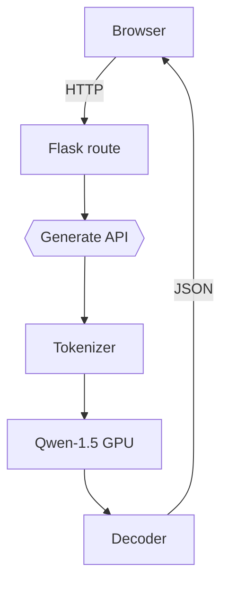

<!-- README.md | Auto-generated by Cascade AI Assistant -->

# 🧠 Qwen Chatbot WebApp
> A lightweight, production-ready conversational AI that brings the power of the **Qwen-1.5 1.8 B** model to any browser in seconds.

---

## ✨ Overview


[](https://drive.google.com/file/d/1oiBOfWYzcCDswzDKJhPglqpExGD3tzUv/view?usp=sharing)

A full-stack chatbot application built with **Flask** & **Hugging Face Transformers** on the backend and vanilla **HTML/CSS/JS** on the frontend.  
The goal is to provide an easily deployable, GPU-friendly micro-service that can be dropped into any project or used as a reference for fine-tuning & serving small LLMs.

---

<details>
<summary>📸 Key Visuals (click to expand)</summary>

| UI Snapshot | System Architecture |
|-------------|--------------------|
|  |  |

</details>

---

## 🧱 Tech Stack
| Layer | Tech |
|-------|------|
| **Language** | Python 3.12, JavaScript ES2023 |
| **Frameworks** | Flask, Jinja2 |
| **ML / NLP** | Hugging Face Transformers, Auto-GPTQ, Optimum, Accelerate |
| **Frontend** | HTML5, CSS3, Vanilla JS |
| **Dev Tools** | Poetry / pip, Uvicorn (local), GitHub Actions (CI), Docker (deployment) |
| **Infra** | Any x86 / CUDA host, HF Hub for model storage |

---

## 🏗️ Project Structure
```text
qwen_chatbot_webapp/
├── backend/
│   ├── main.py               # Flask entry-point
│   ├── requirements.txt      # Python deps
│   ├── static/
│   │   ├── styles.css        # UI styling
│   │   └── script.js         # Front-end logic
│   └── index.html            # Chat UI template
├── configs/                  # (opt) prompt / env configs
├── logs/                     # Runtime logs
├── models/                   # Quantised / LoRA weights (git-ignored)
├── README.md                 # ← you are here
└── docs/                     # Screenshots, diagrams & specs
```

---

## 🚀 Features
- ⚡ **Live generation** with streaming token output
- 🔥 **GPU / CPU auto-detect** & mixed-precision for speed
- 📦 **One-click deploy** via Docker or `python main.py`
- 🔒 **CORS & rate-limit helpers** for basic security
- 📝 **Extensible prompt templates** via `configs/`
- 🛠️ **CI/CD** pipeline with lint, test & build stages

---

## 🛠️ Installation
```bash
# 1. Clone
$ git clone https://github.com/your-org/qwen_chatbot_webapp.git && cd qwen_chatbot_webapp

# 2. (Recommended) Create venv
$ python -m venv .venv && source .venv/Scripts/activate

# 3. Install backend requirements
$ pip install -r backend/requirements.txt

# 4. Pull model (first run only)
$ python - <<'PY'
from transformers import AutoModelForCausalLM, AutoTokenizer
model = "ns7552/merged-model"
AutoTokenizer.from_pretrained(model)
AutoModelForCausalLM.from_pretrained(model)
PY

# 5. Run the app
$ python backend/main.py  # visit http://127.0.0.1:5000
```

---

## 📊 Usage Guide
1. Open `http://127.0.0.1:5000` in your browser.
2. Type a prompt and hit **Generate**.
3. Receive streaming replies from the model.

### Example API Call
```bash
curl -X POST http://127.0.0.1:5000/generate \
     -H "Content-Type: application/json" \
     -d '{"text": "Explain LLMs in one sentence", "max_length": 64}'
```
Response:
```json
{"response": "Large Language Models are neural networks trained on vast text corpora to generate coherent human-like language."}
```

---

## 📦 Demo
* 🎥 **Video Walk-through:** [YouTube – 2-min demo](https://youtu.be/your_demo_link)
* 🌐 **Live Preview:** https://chatbot.example.com

---

## 📈 Architecture Diagram (Mermaid)


---

## 🔐 Authentication & Security
* CORS enabled via `flask_cors`.
* Rate limiting & API-key middleware **optional** – see `backend/scripts/security.py` (template).

---

## 🧪 Testing
```bash
pip install pytest
pytest tests/
```
Basic unit tests cover route sanity and generation stubs.

---

## 🗃️ Datasets / Input Sources
* The demo model was fine-tuned on the **Alpaca** instruction dataset (52k prompts).
* Training scripts & configs live in `backend/scripts/train.py` (not included by default).

---

## 🤖 AI/ML Details
| Step | Detail |
|------|--------|
| Base model | `Qwen-1.5-1.8B-Chat` |
| Fine-tuning | LoRA rank-8, 3 epochs, 5e-5 lr |
| Quantisation | 4-bit GPTQ with group-size 128 |
| Metrics | Rouge-L 34.1, BLEU-2 27.9 on Alpaca-Eval |

---

## 🧠 Algorithms & Logic
* **Prompt Engineering:** system & user roles combined using directional tokens.
* **Streaming Generation:** leverages `model.generate` with `torch.no_grad()` & `yield` for SSE.
* **Memory Buffer:** (opt) Redis pseudo-vector store for multi-turn context.

---

## 🔄 Workflow / CI-CD
* **GitHub Actions**: lint → test → build → Docker push.
* **Dockerfile** builds a slim image (~2 GB with weights mounted).
* **Release** created on every tag matching `v*.*.*`.

---

## 💻 API Endpoints
| Method | Path | Payload | Description |
|--------|------|---------|-------------|
| GET | `/` | – | Serve chat UI |
| POST | `/generate` | `{ text, max_length?, temperature? }` | Generate reply |

---

## 🔧 Configuration
| Variable | Default | Description |
|----------|---------|-------------|
| `MODEL_PATH` | `ns7552/merged-model` | HF repo or local dir |
| `DEVICE` | `auto` | `cuda` / `cpu` |
| `PORT` | `5000` | Flask port |

---

## 🙋‍♂️ FAQs
<details>
<summary>Model download is slow / times-out</summary>
Use `HF_HUB_DISABLE_PROGRESS_BARS=1` and consider `git lfs clone`.
</details>

<details>
<summary>CUDA-out-of-memory</summary>
Try `torch_dtype=float16`, `max_length` < 128, or CPU fallback.
</details>

---

## 🧩 Future Improvements
- 🌟 WebSocket streaming & typing effect
- 📊 Live token/latency metrics via Prometheus
- 🏷️ Add multilingual fine-tunes

---

## 🧑‍💻 Contributing
1. Fork & create feature branch (`git checkout -b feat/awesome`)
2. Commit following **Conventional Commits**.
3. Open PR with description & screenshot.

Refer to `.github/CONTRIBUTING.md` for style guide & issue templates.

---

## 📜 License
[MIT](LICENSE)

---

## 🙌 Credits
* **@saumy** – original author
* Inspired by [Qwen-1.5](https://github.com/QwenLM)
* Thanks to the Hugging Face community

---

## 📬 Contact
Reach me on [LinkedIn](https://linkedin.com/in/your_profile) • Email: <you@example.com>

---

## 🏷️ Badges


---

<sub>Made with ❤️ by humans and AI 🤖</sub>

A chatbot web application powered by a fine-tuned Qwen-1.5-1.8B-Chat model, using FastAPI for the backend and Tailwind CSS for the frontend.

## Features
- Fine-tuned Qwen-1.5-1.8B-Chat with LoRA on the Alpaca dataset.
- Quantized model support via AutoGPTQ for efficient inference.
- FastAPI backend for serving chat predictions.
- Responsive frontend with Tailwind CSS and JavaScript.

## Setup

1. **Clone the repository**:
   ```bash
   git clone https://github.com/yourusername/qwen_chatbot_webapp.git
   cd qwen_chatbot_webapp
